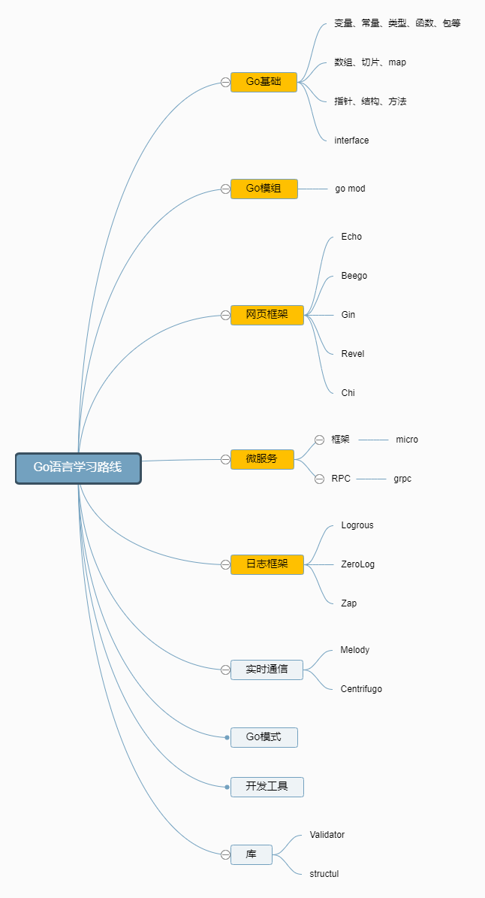

# go_study

- [后端学习路线](https://github.com/wxxhub/my_study/blob/master/RD/README.md)

## 
- [GMP](GMP/README.md)
- [反射](reflect/README.md)
- [grpc](grpc/README.md)
  
## 学习路线图

## 资源
1. 命令行工具
   1. [cobra](https://github.com/spf13/cobra)
   2. [urfave/cli](https://github.com/urfave/cli)

2. 网页框架 + 路由
   1. [Echo](https://github.com/labstack/echo)
   2. [Beego](https://github.com/astaxie/beego)
   3. [Gin](https://github.com/gin-gonic/gin)
   4. [Revel](https://github.com/revel/revel)
   5. [Chi](https://github.com/go-chi/chi)

3. 数据库
   1. 关系型
      1. [SQL Server](https://www.microsoft.com/en-us/sql-server/sql-server-2017)
      2. [PostgreSQL](https://www.postgresql.org/)
      3. [MariaDB](https://mariadb.org/)
      4. [MySQL](https://www.mysql.com/)
      5. [CockroachDB](https://www.cockroachlabs.com/)
   2. 云数据库
      - [CosmosDB](https://docs.microsoft.com/en-us/azure/cosmos-db)
      - [DynamoDB](https://aws.amazon.com/dynamodb/)
   3. 搜索引擎
      - [ElasticSearch](https://www.elastic.co/)
      - [Solr](http://lucene.apache.org/solr/)
      - [Sphinx](http://sphinxsearch.com/)
   4. NoSQL
      - [MongoDB](https://www.mongodb.com/)
      - [Redis](https://redis.io/)
      - [Apache Cassandra](http://cassandra.apache.org/)
      - [LiteDB](https://github.com/mbdavid/LiteDB)
      - [RavenDB](https://github.com/ravendb/ravendb)
      - [CouchDB](http://couchdb.apache.org/)

4. 对象关系映射框架
   1. [Gorm](https://github.com/jinzhu/gorm)
   2. [Xorm](https://github.com/go-xorm/xorm)

5. 高速缓存
   1. [GCache](https://github.com/bluele/gcache)
   2. 分布式缓存
      1. [Go-Redis](https://github.com/go-redis/redis)
      2. [GoMemcached](https://github.com/bradfitz/gomemcache)

6. 日志
   1. 日志框架
      - [Zap](https://github.com/uber-go/zap)
      - [ZeroLog](https://github.com/rs/zerolog)
      - [Logrus](https://github.com/sirupsen/logrus)
   2. 日志管理系统
      - [Sentry.io](http://sentry.io)
      - [Loggly.com](https://loggly.com)

7. 实时通讯
   1. [Socket.IO](https://socket.io/)

8.  API 客户端
    1. REST
       - [Gentleman](https://github.com/h2non/gentleman)
       - [GRequests](https://github.com/kennethreitz/grequests)
       - [heimdall](https://github.com/heimdal/heimdal)
    2. [GraphQL](https://graphql.org/)
       - [gqlgen](https://github.com/99designs/gqlgen)
       - [graphql-go](https://github.com/graph-gophers/graphql-go)

9.  最好知道
    - [Validator](https://github.com/chriso/validator.js/)
    - [Glow](https://github.com/pytorch/glow)
    - [GJson](https://github.com/tidwall/gjson)
    - [Authboss](https://github.com/volatiletech/authboss)
    - [Go-Underscore](https://github.com/ahl5esoft/golang-underscore)

10. 测试
    1. 单元，行为，集成测试
       1. [GoMock](https://github.com/golang/mock)
       2. [Testify](https://github.com/stretchr/testify)
       3. [GinkGo](https://github.com/onsi/ginkgo)
       4. [GoMega](https://github.com/onsi/gomega)
       5. [GoCheck](https://github.com/go-check/check)
       6. [GoDog](https://github.com/DATA-DOG/godog)
       7. [GoConvey](https://github.com/smartystreets/goconvey)
    2. 端对端测试
       - [Selenium](https://github.com/tebeka/selenium)
       - [Endly](https://github.com/viant/endly)

11. 任务调度
    - [Gron](https://github.com/roylee0704/gron)
    - [JobRunner](https://github.com/bamzi/jobrunner)

12. 微服务
    1. 消息队列
       - [RabbitMQ](https://www.rabbitmq.com/tutorials/tutorial-one-go.html)
       - [Apache Kafka](https://kafka.apache.org/)
       - [ActiveMQ](https://github.com/apache/activemq)
       - [Azure Service Bus](https://docs.microsoft.com/en-us/azure/service-bus-messaging/service-bus-messaging-overview)
    2. 消息总线
       - [Message-Bus](https://github.com/vardius/message-bus)
    3. 框架
         - [GoKit](https://github.com/go-kit/kit)
         - [Micro](https://github.com/micro/go-micro)
         - [rpcx](https://github.com/smallnest/rpcx)
         - [istio](https://github.com/istio/istio)
    4. RPC
         - [Protocol Buffers](https://github.com/protocolbuffers/protobuf)
         - [gRPC-Go](https://github.com/grpc/grpc-go)
         - [gRPC-Gateway](https://github.com/grpc-ecosystem/grpc-gateway)
         - [Twirp](https://github.com/twitchtv/twirp)

13. [Go-模式](https://github.com/tmrts/go-patterns)
